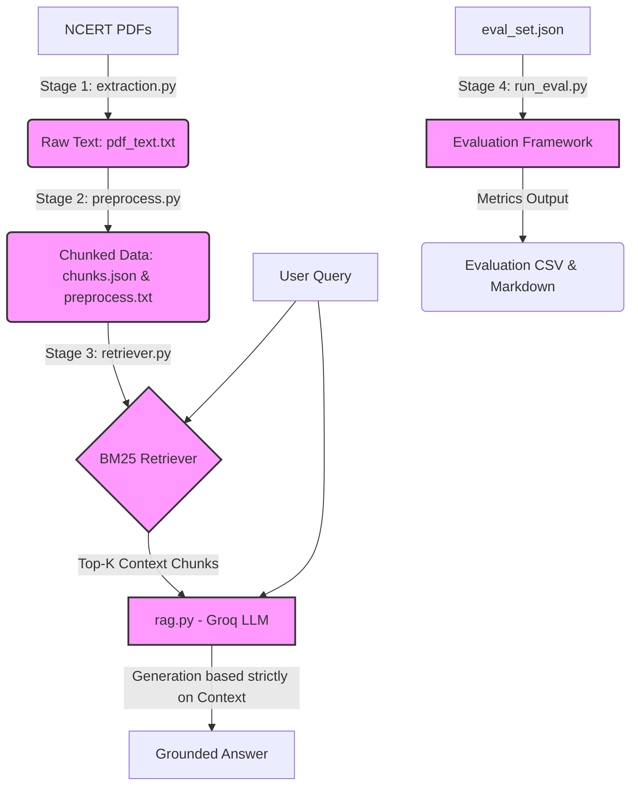

# 📚 NCERT RAG — Production-Grade Document Intelligence


A production-grade, four-stage **Retrieval-Augmented Generation (RAG)** system built specifically for **NCERT Class 9 Science** (Motion, Force & Laws of Motion, Gravitation). This project seamlessly ingests PDF textbooks, chunks them systematically, retrieves relevant context using BM25 lexical search, and generates grounded answers utilizing the Groq API (Llama 3.1 8B).

---

## 🏗 System Architecture

The pipeline is completely modular and orchestrated by a master script, utilizing BM25 for fast, accurate lexical retrieval, followed by LLM-powered generation ensuring textbook-grounded answers.



---

## 🔗 Resources & Prerequisites

Before running the application, ensure you have the following prerequisites in place:

1. **Python 3.9+** is required.
2. **Groq API Key**: Essential for querying the Llama 3 LLM. You can grab an API key by signing up at [Groq Console](https://console.groq.com/).
3. **Dataset (PDFs)**: You must download the NCERT Science Class 9 textbook PDFs to feed into the data extraction pipeline. 
   📥 **Link for downloading OS PDF files for NCERT:** [NCERT Textbook Portal](https://ncert.nic.in/textbook.php?iesc1=0-11)

*Please save the downloaded PDF files inside the `data/raw/` directory after creating the directory structure as shown below.*

---

## 📂 Project Structure

```text
NCERT RAG Project/
├── config.py                   # Centralized paths, model & chunking settings 
├── pipeline.py                 # Master orchestrator — runs all stages end-to-end
│
├── extraction.py               # Stage 1 — PDF extraction utilizing PyMuPDF
├── preprocess.py               # Stage 2 — Sentence-level Chunking (chunks.json)
├── retriever.py                # Stage 3 — BM25 Lexical Retriever engine
├── rag.py                      # LLM grounded generation (Groq API)
│
├── evaluation/
│   ├── eval_set.json           # 19-question evaluation dataset
│   ├── run_eval.py             # Evaluation runner
│   └── results/                # Auto-generated CSV & MD reports (ignored by git)
│
├── data/
│   ├── raw/                    # 📥 Place your downloaded NCERT PDF(s) here
│   └── processed/              # Auto-generated intermediate parsing files
│       ├── pdf_text.txt
│       ├── chunks.json
│       └── preprocess.txt
│
├── requirements.txt            # Project Python dependencies
└── README.md                   # Project Documentation
```

---

## 🚀 Setup & Installation Steps

**1. Clone the repository and navigate to the root directory:**
```bash
git clone <your-repo-url>
cd "NCERT RAG Project"
```

**2. Create and activate a virtual environment:**
```bash
python3 -m venv .env
source .env/bin/activate  # On Windows use: .env\Scripts\activate
```

**3. Install the necessary dependencies:**
```bash
pip install -r requirements.txt
```

**4. Add your Groq API Key:**
To authorize LLM requests in the RAG pipeline, export your Groq API key in the shell, or paste it directly in the `USER_API_KEY` variable inside `rag.py`.
```bash
export GROQ_API_KEY="gsk-..." # Replace with your actual key
```

---

## ⚙️ Usage & Pipeline Execution

The system is highly configurable and operated via the `pipeline.py` master orchestrator.

### 1. Run the Full Pipeline End-to-End
This sequence executes Extraction → Preprocessing → Retrieval Smoke-Test → Evaluation.
```bash
python pipeline.py
```

### 2. Resume From a Specific Stage
Skip time-consuming prior stages (like PDF extraction) during development.
```bash
python pipeline.py --from stage3   # Skip extraction & preprocessing, go to BM25
```

### 3. Skip Evaluation
Speeds up the development iteration loop.
```bash
python pipeline.py --skip-eval
```

### 4. Run Individual Modules Separately
```bash
python extraction.py              # Extract raw text from PDFs
python preprocess.py              # Chunk text logically into sentences
python retriever.py               # Test the BM25 retrieval functionality
python rag.py                     # Single Q&A LLM execution test
python evaluation/run_eval.py     # Trigger the comprehensive evaluation suite
```

---

## 🧠 Chunking Strategy

This project leverages an intelligent **sliding-window sentence chunking** mechanism:
- **Window Size:** 5 sentences per chunk.
- **Overlap:** 2-sentence (40%) overlap.
- **Why?** A given sentence in this NCERT science textbook averages ~20 tokens, meaning each chunk is around 100 tokens long. The 40% overlap ensures concepts that span across chunk boundaries are retained cohesively. By keeping boundaries strictly at the sentence level (via `nltk.tokenize.punkt`), no concept is ever split awkwardly mid-sentence.

---

## 📊 Evaluation Framework

The project includes a rigorous, programmatic evaluation suite (`evaluation/run_eval.py`) that scores system performance over a fixed dataset (`eval_set.json`). 

It tests across **19 questions** split into three distinct categories:

| Category | Count | Purpose |
|----------|-------|---------|
| **Textbook** | 12 | Directly assesses end-of-chapter exercises |
| **Paraphrase** | 3 | Same answer required, but utilizes different wording |
| **Out-of-scope** | 4 | Tests whether the LLM correctly refuses ungrounded queries |

The generated answers are fundamentally scored on three main axes: 
1. **Correctness** 
2. **Grounding** 
3. **Refusal-appropriateness**

*Post-execution, results are compiled safely into `evaluation/results/evaluation_results.csv` and a readable `.md` summary format.*

---

## 🛠 Configuration Details

There are absolutely no hardcoded strings floating around in individual files. System paths, model parameters, and algorithmic constants are comprehensively consolidated inside `config.py`.

| Variable | Default Value | Purpose |
|---------|---------|-------------|
| `CHUNK_WINDOW` | `5` | Defines sentences per logical chunk block |
| `CHUNK_OVERLAP` | `2` | Number of overlapping sentences |
| `TOP_K` | `3` | Documents retrieved dynamically per query by BM25 |
| `LLM_MODEL` | `llama-3.1-8b-instant` | The high-efficiency Groq Model parameter |

*To modify the application's core logic or testing constraints, you only ever need to alter `config.py`.*
