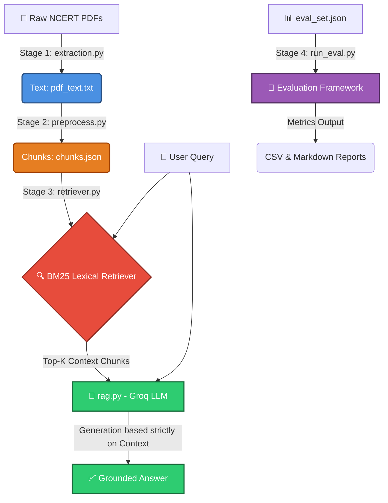

<div align="center">

# 📚 NCERT Retrieval-Ready Study Assistant
**A Production-Grade Document Intelligence & RAG System for Class 9 Science**

[](https://python.org)
[](https://groq.com)
[](https://console.groq.com)
[](#)

*An intelligent, hallucination-free educational assistant that answers student queries **strictly** using curriculum-approved NCERT textbooks.*

</div>

---

## 🌟 Overview

The **Retrieval-Ready Study Assistant** is a modular, four-stage **Retrieval-Augmented Generation (RAG)** pipeline. It is specifically calibrated for **NCERT Class 9 Science** chapters (Motion, Force & Laws of Motion, Gravitation). By coupling high-speed lexical retrieval (BM25) with high-accuracy generation (Llama 3.1), the system strictly grounds every answer in the textbook text and firmly refuses to answer out-of-syllabus questions.

---

## 📥 Required Resources: Download NCERT PDFs

> [!IMPORTANT]
> **You must provide the raw textbook files before running the pipeline!**
> The system requires the official NCERT chapter PDFs to function. 

You can download the **official, open-source PDF files for NCERT Class 9 Science** directly from the government portal:

🔗 **[Click Here to Download NCERT Textbook PDFs](https://ncert.nic.in/textbook.php?iesc1=0-11)**

**Instructions:**
1. Navigate to the link above.
2. Select Class: **Class IX** | Subject: **Science** | Book Title: **Science**.
3. Download the relevant chapter PDFs (e.g., Chapter 7, 8, 9).
4. Save the `.pdf` files directly into your `data/raw/` folder in this project.

---

## 🏗 System Architecture

The pipeline is completely modular, orchestrated by a master script (`pipeline.py`). It utilizes a deterministic approach to data parsing and retrieval, ensuring maximum factual reliability.



---

## 📂 Project Structure

```text
NCERT RAG Project/
├── config.py                   # ⚙️ Centralized paths, model & chunking settings 
├── pipeline.py                 # 🚀 Master orchestrator — runs all stages end-to-end
│
├── extraction.py               # 📄 Stage 1 — PDF extraction utilizing PyMuPDF
├── preprocess.py               # ✂️ Stage 2 — Sentence-level Chunking
├── retriever.py                # 🔍 Stage 3 — BM25 Lexical Retriever engine
├── rag.py                      # 🧠 LLM grounded generation (Groq API)
│
├── evaluation/
│   ├── eval_set.json           # 📋 19-question evaluation dataset
│   ├── run_eval.py             # 🧪 Evaluation runner
│   └── results/                # 📈 Auto-generated CSV & MD reports
│
├── data/
│   ├── raw/                    # 📥 Place your downloaded NCERT PDF(s) here!
│   └── processed/              # ⚙️ Auto-generated intermediate parsing files
│
└── requirements.txt            # 📦 Project Python dependencies
```

---

## 🚀 Installation & Quick Start

**1. Clone the repository:**
```bash
git clone <your-repo-url>
cd "NCERT RAG Project"
```

**2. Initialize your Virtual Environment:**
```bash
python3 -m venv .env
source .env/bin/activate  # Windows users: .env\Scripts\activate
```

**3. Install Dependencies:**
```bash
pip install -r requirements.txt
```

**4. Authenticate Groq LLM:**
Grab your free API key from the [Groq Console](https://console.groq.com/). Export it to your terminal:
```bash
export GROQ_API_KEY="gsk_your_api_key_here"
```

---

## ⚡ Using the Pipeline

Control the entire system seamlessly via the master orchestrator, `pipeline.py`.

| Command | Action Performed |
|---------|-----------------|
| `python pipeline.py` | Runs the full pipeline End-to-End (Extraction → Eval). |
| `python pipeline.py --from stage3` | Resumes from retrieval (skips time-consuming PDF extraction). |
| `python pipeline.py --skip-eval` | Runs the system but skips the final automated evaluation. |

You can also run individual components manually if you are debugging:
```bash
python extraction.py              # Extract raw text
python preprocess.py              # Chunk text into sentences
python retriever.py               # Test BM25 retrieval manually
python rag.py                     # Single Q&A LLM execution test
```

---

## 🧠 Advanced Chunking Strategy

This project leverages an intelligent **sliding-window sentence chunking** mechanism to maintain context:
- **Window Size:** `5` sentences per chunk (~100 tokens).
- **Overlap:** `2` sentences (40%) overlap.
- **Why?** Physics concepts frequently span multiple consecutive sentences. A 40% overlap ensures that boundaries never arbitrarily sever a core concept from its mathematical explanation. By relying on NLTK's `punkt` tokenizer, boundaries are strictly kept at the sentence level.

---

## 📊 Evaluation Framework

The project enforces pedagogical safety via a rigorous, programmatic evaluation suite (`evaluation/run_eval.py`). It automatically tests the pipeline against **19 curated questions**:

* **Textbook (12):** End-of-chapter physics questions.
* **Paraphrase (3):** Robustness checks against alternate wording.
* **Out-of-scope (4):** Safety checks ensuring the LLM correctly refuses ungrounded/hallucinated queries.

> **Evaluation Metrics:** Every answer is scored on **Correctness**, **Grounding** (did it use the textbook?), and **Refusal-appropriateness** (did it safely reject out-of-syllabus questions?).

---

## 🛠 Configuration

There are **zero hardcoded strings** scattered across the scripts. Modify algorithmic constants exclusively inside `config.py`.

| Variable | Value | Purpose |
|---------|-------|-------------|
| `CHUNK_WINDOW` | `5` | Defines sentences per logical chunk block |
| `CHUNK_OVERLAP` | `2` | Number of overlapping sentences |
| `TOP_K` | `3` | Number of context documents retrieved by BM25 |
| `LLM_MODEL` | `llama-3.1-8b-instant` | The high-efficiency Groq Model parameter |

---
<div align="center">
<i>Built for reliable, hallucination-free educational intelligence.</i>
</div>
