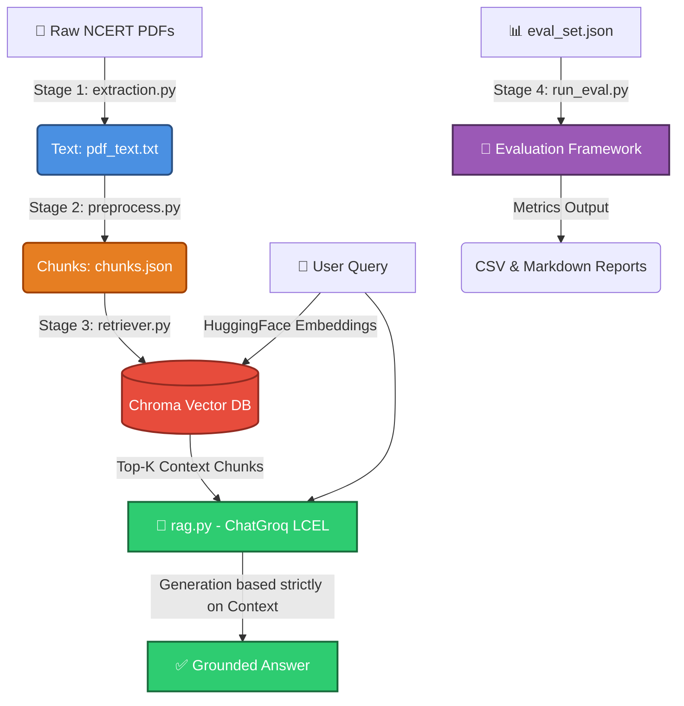

<div align="center">

# 📚 NCERT Retrieval-Ready Study Assistant
**A Production-Grade Document Intelligence & RAG System for Class 9 Science**

[](https://python.org)
[](https://langchain.com)
[](https://groq.com)
[](https://console.groq.com)
[](https://trychroma.com)
[](https://huggingface.co/sentence-transformers/all-MiniLM-L6-v2)

*An intelligent, hallucination-free educational assistant that answers student queries **strictly** using curriculum-approved NCERT textbooks.*

</div>

---

## 🌟 Overview

The **Retrieval-Ready Study Assistant** is a modular, four-stage **Retrieval-Augmented Generation (RAG)** pipeline completely powered by **LangChain**. It is specifically calibrated for **NCERT Class 9 Science** chapters (Motion, Force & Laws of Motion, Gravitation). By coupling high-fidelity **semantic retrieval** (ChromaDB + HuggingFace) with lightning-fast generation (Groq LPU), the system strictly grounds every answer in the textbook text and firmly refuses to answer out-of-syllabus questions. Best of all, it requires **zero paid API keys**!

---

## 📥 Required Resources: Download NCERT PDFs

> [!IMPORTANT]
> **You must provide the raw textbook files before running the pipeline!**
> The system requires the official NCERT chapter PDFs to function. 

You can download the **official, open-source PDF files for NCERT Class 9 Science** directly from the government portal:

🔗 **[Click Here to Download NCERT Textbook PDFs](https://ncert.nic.in/textbook.php?iesc1=0-11)**

**Instructions:**
1. Navigate to the link above.
2. Select Class: **Class IX** | Subject: **Science** | Book Title: **Science**.
3. Download the relevant chapter PDFs (e.g., Chapter 7, 8, 9).
4. Save the `.pdf` files directly into your `data/raw/` folder in this project.

---

## 🏗 System Architecture

The pipeline is completely modular, orchestrated by a master script (`pipeline.py`). It utilizes LangChain's Expression Language (LCEL) and persistent vector stores to ensure maximum factual reliability.



---

## 📂 Project Structure

```text
NCERT RAG Project/
├── config.py                   # ⚙️ Centralized paths, model & chunking settings 
├── pipeline.py                 # 🚀 Master orchestrator — runs all stages end-to-end
│
├── extraction.py               # 📄 Stage 1 — PDF extraction utilizing PyMuPDF
├── preprocess.py               # ✂️ Stage 2 — Advanced chunking logic
├── retriever.py                # 🔍 Stage 3 — Chroma Semantic Retriever & HuggingFace
├── rag.py                      # 🧠 Stage 4 — ChatGroq LCEL grounded generation 
│
├── evaluation/
│   ├── eval_set.json           # 📋 19-question evaluation dataset
│   ├── run_eval.py             # 🧪 Evaluation runner
│   └── results/                # 📈 Auto-generated CSV & MD reports
│
├── data/
│   ├── raw/                    # 📥 Place your downloaded NCERT PDF(s) here!
│   ├── processed/              # ⚙️ Auto-generated intermediate parsing files
│   └── chroma_db/              # 🗄️ Persisted semantic vector store
│
├── .env                        # 🔐 Local environment variables (API Keys)
└── requirements.txt            # 📦 Project Python dependencies
```

---

## 🚀 Installation & Quick Start

**1. Clone the repository:**
```bash
git clone <your-repo-url>
cd "NCERT RAG Project"
```

**2. Initialize your Virtual Environment:**
```bash
python3 -m venv venv
source venv/bin/activate  # Windows users: venv\Scripts\activate
```

**3. Install Dependencies:**
```bash
pip install -r requirements.txt
```

**4. Set Up Environment Variables:**
The application uses a `.env` file to manage secrets securely. Create one in the project root:
```bash
touch .env
```
Inside `.env`, securely paste your free [Groq API Key](https://console.groq.com/):
```env
GROQ_API_KEY=gsk_your_actual_key_here
```
*(Note: Because we use free HuggingFace local embeddings, you **do not** need an OpenAI key!)*

---

## ⚡ Using the Pipeline

Control the entire system seamlessly via the master orchestrator, `pipeline.py`.

| Command | Action Performed |
|---------|-----------------|
| `python pipeline.py` | Runs the full pipeline End-to-End (Extraction → Eval). |
| `python pipeline.py --from stage3` | Resumes from retrieval (skips time-consuming PDF extraction & chunking). |
| `python pipeline.py --skip-eval` | Runs the system but skips the final automated evaluation. |

You can also run individual components manually if you are debugging:
```bash
python extraction.py              # Extract raw text
python preprocess.py              # Chunk text
python retriever.py               # Build Chroma DB & test retrieval
python rag.py                     # Single Q&A LLM execution test
```

---

## 🧠 Semantic Search & Local Embeddings

Unlike legacy keyword-search systems, this project natively understands the **meaning** behind student queries using **semantic similarity**:
- **Embeddings:** Powered by `sentence-transformers/all-MiniLM-L6-v2` via HuggingFace. These run 100% locally on your machine for free, preserving privacy.
- **Vector Database:** High-performance persistence is handled by **ChromaDB**. Once documents are embedded, they are saved locally in `data/chroma_db/`, allowing for instant start-ups on future runs.

---

## 📊 Evaluation Framework

The project enforces pedagogical safety via a rigorous, programmatic evaluation suite (`evaluation/run_eval.py`). It automatically tests the pipeline against **19 curated questions**:

* **Textbook (12):** End-of-chapter physics questions.
* **Paraphrase (3):** Robustness checks against alternate wording.
* **Out-of-scope (4):** Safety checks ensuring the LLM correctly refuses ungrounded/hallucinated queries.

> **Evaluation Metrics:** Every answer is scored on **Correctness**, **Grounding** (did it use the textbook?), and **Refusal-appropriateness** (did it safely reject out-of-syllabus questions?).

---

## 🛠 Configuration

There are **zero hardcoded strings** scattered across the scripts. Modify algorithmic constants exclusively inside `config.py`.

| Variable | Value | Purpose |
|---------|-------|-------------|
| `LLM_MODEL` | `llama-3.1-8b-instant` | The high-efficiency Groq Model parameter |
| `EMBEDDING_MODEL` | `sentence-transformers/...` | Defines the HuggingFace local embedding model |
| `LANGCHAIN_CHUNK_SIZE` | `600` | Controls chunk length |
| `TOP_K` | `3` | Number of context documents retrieved by ChromaDB |

---
<div align="center">
<i>Built for reliable, hallucination-free educational intelligence.</i>
</div>
